<h1>Draw Objects App</h1>

### Mục lục
[1. Đề bài](#1-đề-bài)

[2. Sơ đồ lớp](#2-sơ-đồ-lớp)

[3. Thiết kế lớp](#3-thiết-kế-lớp)
- [3.1 Lớp điểm (class Point)](#31-lớp-điểm-class-point)
- [3.2 Lớp đối tượng (class _Shape)](#32-lớp-đổi-tượng-class-_shape)
    - [3.2.1 Xây dựng lớp](#321-xây-dựng-lớp)
    - [3.2.2 Thuật toán tìm phần giao giữa hai đối tượng hình bất kỳ](#322-thuật-toán-tìm-phần-giao-giữa-hai-đối-tượng-hình-bất-kỳ)
- [3.3 Lớp hình Ellipse (class _Ellipse)](#33-lớp-hình-ellipse-class-_ellipse)
    - [3.3.1 Xây dựng lớp](#331-xây-dựng-lớp)
    - [3.3.2 Thuật toán kiểm tra vị trí tương đối giữa một điểm và hình Ellipse](#332-thuật-toán-kiểm-tra-vị-trí-tương-đối-giữa-một-điểm-và-hình-ellipse)
- [3.4 Lớp hình Tròn (class _Circle)](#34-lớp-hình-tròn-class-_circle)
- [3.5 Lớp hình Đa giác (class _Polygon)](#35-lớp-hình-đa-giác-class-_polygon)
    - [3.5.1 Xây dựng lớp](#351-xây-dựng-lớp)
    - [3.5.2 Thuật toán kiểm tra một điểm nằm trong hình đa giác](#352-thuật-toán-kiểm-tra-một-điểm-nằm-trong-hình-đa-giác)
    - [3.5.3 Thuật toán kiểm tra một điểm nằm trên biên của hình đa giác](#353-thuật-toán-kiểm-tra-một-điểm-nằm-trên-biên-của-hình-đa-giác)
- [3.6 Lớp hình Tam giác (class _Triangle)](#36-lớp-hình-tam-giác-class-_triangle)
- [3.7 Lớp Hình Chữ Nhật (class _Rectangle)](#37-lớp-hình-chữ-nhật-class-_rectangle)
- [3.8 Lớp Hình Vuông (class _Square)](#38-lớp-hình-vuông-class-_square)

[4. Thiết kế ứng dụng vẽ hình trong môi trường Windows](#4-thiết-kế-ứng-dụng-vẽ-hình-trong-môi-trường-windows)
- [4.1 Tạo đối tượng và hình vẽ](#41-tạo-đối-tượng-và-hình-vẽ)
    - [4.1.1 Tạo đối tượng](#411-tạo-đối-tượng)
    - [4.1.2 Vẽ hình](#412-vẽ-hình)
- [4.2 Các thao tác trên cửa sổ ứng dụng](#42-các-thao-tác-trên-cửa-sổ-ứng-dụng)
    - [4.2.1 Thao tác di chuyển đối tượng bằng cách kéo thả chuột](#421-thao-tác-di-chuyển-đối-tượng-bằng-cách-kéo-thả-chuột)
    - [4.2.2 Thao tác di chuyển đối tượng bằng bàn phím](#422-thao-tác-di-chuyển-đối-tượng-bằng-bàn-phím)
    - [4.2.3 Thao tác thay đổi đối tượng hình học bằng phím Tab](#423-thao-tác-thay-đổi-đối-tượng-hình-học-bằng-phím-tab)
    - [4.2.4 Thao tác phóng to, thu nhỏ đối tượng bằng bàn phím](#424-thao-tác-phóng-to-thu-nhỏ-đối-tượng-bằng-bàn-phím)
    - [4.2.5 Thao tác xoay đối tượng bằng bàn phím](#425-thao-tác-xoay-đối-tượng-bằng-bàn-phím)

[5 Hướng dẫn cài đặt và chạy chương trình](#5-hướng-dẫn-cài-đặt-và-chạy-chương-trình)

[6 Kết quả](#6-kết-quả)
    

=======================================================
<a name='1Debai'></a>  
# 1. **Đề bài**
<p style="text-align: justify; text-justify: inter-word;">Cho các loại đối tượng: hình tròn, hình ellipse, đa giác, hình chữ nhật, hình vuông, hình tam giác. Viết chương trình ứng dụng cho phép tạo (hoặc nhập) hai hình thuộc một trong các hình kể trên. In thông báo cho biết hai hình có giao nhau không, nếu có tô màu phần giao và tô đậm đường biên của phần giao. Người sử dụng có thể bấm các phím mũi tên để di chuyển một trong hai hình, phím +, −, để phóng to thu nhỏ một trong hai hình. Có thể lập trình trong môi trường Window. Sử dụng đa hình để giải quyết vấn đề trên.</p>

<a name='2Sodolop'></a>  

# 2. **Sơ đồ lớp**
Dựa vào yêu cầu bài tập lớn, ta xây dựng được các lớp có sơ đồ như sau:

<center>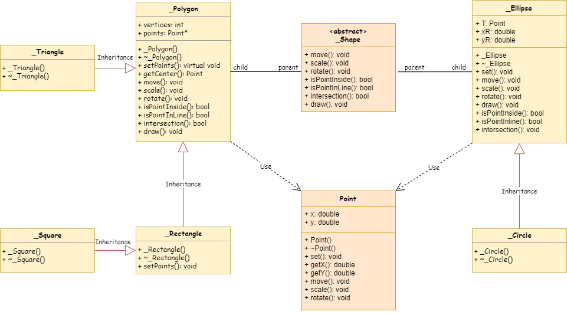</center>

<a name='3Thietkelop'></a>  
# 3. Thiết kế lớp

<a name='31lopdiem'></a> 
## 3.1 Lớp điểm (class Point)

```c++
class Point {
  double x, y;
  public:
    // constructor and destructor
    Point(double xx = 0, double yy = 0): x(xx), y(yy) {}
    ~Point() {}
  // setter
  void set(double xx, double yy) {
    x = xx;
    y = yy;
  }
  // getter
  double getX() const {
    return x;
  }
  double getY() const {
    return y;
  }
  // operation
  void move(double dx, double dy) {
    x += dx;
    y += dy;
  }
  void scale(Point center, double tile);
  void rotate(Point T, double rad);
  // paint
  void mark(HDC hdc, int size = 5, COLORREF c = RGB(0, 0, 0));
  // other method
  double distance(Point a) const;
  Point setVector(Point b) const;
};

```

Trong đó

```C++
void move(double dx, double dy);

void scale(Point center, double tile);

void rotate(Point T, double rad);
```

là các phương thức thực hiện các thao tác tịnh tiến, vị tự, phép quay tâm _T_ (đơn vị độ) của một điểm.

```c++
void mark(HDC hdc, int size = 5, COLORREF c = RGB(0, 0, 0));
```

là phương thức thực hiện đánh dấu (+) một điểm trên cửa sổ ứng dụng.

```c++
double distance(Point a) const;
```

là phương thức thực hiện việc tính khoảng cách giữa hai điểm. Khoảng cách giữa hai điểm $A(x_{1} ,y_{1})$ và $B(x_{2},y_{2})$ được tính thông qua công thức:

$$d = \sqrt{(x_{2}-x_{1})^2 + (y_{2}-y_{1})^2}$$

```c++
Point setVector(Point b) const;
```

là phương thức thực hiện lấy vector giữa hai điểm. Vector $\vec{AB}$ được xác định bằng

$$\vec{AB} = (x_{B}-x_{A};y_{B}-y_{A})$$

<a name ="32lopdoituong"></a>
## 3.2 Lớp đổi tượng (class _Shape)

<a name ="321xaydunglop"></a>
### 3.2.1 Xây dựng lớp

Ta xây dựng một lớp cơ sở trừu tượng (class \_Shape)

```c++
class _Shape {
  public: virtual void move(double dx, double dy) = NULL;
  virtual void scale(double s) = NULL;
  virtual void rotate(double rad) = NULL;
  virtual bool isPointInside(Point p) const = NULL;
  virtual bool isPointInLine(Point p) const = NULL;
  virtual bool intersection(_Shape * aS, HDC hdc, COLORREF c = RGB(156, 200, 30)) const = NULL;
  virtual void draw(HDC hdc, COLORREF c = RGB(0, 100, 100)) const = NULL;
};
```

Trong đó

```C++
virtual bool intersection(_Shape* aS, HDC hdc, COLORREF c = RGB(156, 200, 30)) const = NULL;
```

<p style="text-align: justify; text-justify: inter-word;">là phương thức ảo thuần tuý thực hiện việc kiểm tra hai đối tượng hình học đang xét có giao nhau hay không. Với phương thức này, ta có thuật toán tổng quát tìm phần giao cho hai đối tượng hình học bất kỳ.</p>

<a name ="322thuattoantimphangiaogiua2doituonghinhbatky"></a>
### 3.2.2 Thuật toán tìm phần giao giữa hai đối tượng hình bất kỳ

Để tìm phần giao giữa hai đối tượng bất kỳ, ta sẽ xét các điểm trên hình chữ nhật nhỏ nhất chứa một trong hai đối tượng. Nếu điểm đang xét đều nằm trong cả hai đối tượng thì ta sẽ thay đổi màu của điểm đó bằng hàm $SetPixel()$. Tương tự cho phần biên của phần giao, nếu điểm đang xét thuộc cả ba trường hợp sau thì ta sẽ vẽ một hình tròn bán kính 0.5 tại điểm đó:

- Nếu điểm nằm trên biên của đối tượng 1 và nằm bên trong đối tượng 2,
- Nếu điểm nằm bên trong đối tượng 1 và nằm trên biên của đối tượng 2,
- Nếu điểm nằm trên biên của cả hai dối tượng.

Sau khi xét hết hình chữ nhật ta sẽ có phần giao cần tìm với phần viền được tô đậm.

<a name ="33lophinhellipse"></a>
## 3.3 Lớp hình Ellipse (class _Ellipse)

<a name ="331xaydunglop"></a>
## 3.3.1 Xây dựng lớp

```C++
class _Ellipse: public _Shape {
  protected: Point T;
  double xR,
  yR;
  public:
    // constructor and destructor
    _Ellipse(double xT = 700, double yT = 300, double a = 200, double b = 100): 
    T(xT, yT),xR(a),yR(b) {};
  ~_Ellipse() {}
  // setter
  void set(double xT, double yT) {
    T = Point(xT, yT);
    xR = 0;
    yR = 0;
  }
  // operation
  void move(double dx, double dy) override {
    T.move(dx, dy);
  }
  void scale(double s) override {
    xR *= s;
    yR *= s;
  }
  void rotate(double rad) override {
    if (rad == 90 || rad == -90) {
      double temp = xR;
      xR = yR;
      yR = temp;
    }
  }
  void draw(HDC hdc, COLORREF c = RGB(0, 100, 100)) const override {
    Ellipse(hdc, T.getX() - xR, T.getY() - yR, T.getX() + xR, T.getY() + yR);
  }
  // check
  bool isPointInside(Point p) const override;
  bool isPointInLine(Point p) const override;
  // intersection
  bool intersection(_Shape * aS, HDC hdc, COLORREF c = RGB(156, 200, 30))
  const override;
};
```
Trong đó
 - class <span style="color:rgb(96, 158, 187)">_Ellipse</span> là lớp con được kế thừa từ lớp cha class <span style="color:rgb(96, 158, 187)">_Shape</span>.

 ```C++
void move(double dx, double dy) override;
 ``` 
là phương thức tịnh tiến hình Ellipse bằng cách tịnh tiến tâm T của hình.
 ```C++
void scale(double s) override;
```
là phương thức phóng to (thu nhỏ) hình Ellipse bằng cách nhân độ dài hai bán trục
với tỷ lệ s.
```C++
• void rotate(double rad) override;
```
là phương thức thực hiện quay hình Ellipse với góc quay có đơn vị độ. Ở phương
thức này, ta chỉ xét phép quay với góc $90^\circ$ vì ta sử dụng hàm vẽ Ellipse mặc định
của môi trường Windows nên chỉ có thể vẽ các hình Ellipse có hai bán trục song
song với hai trục toạ độ.
```C++
• bool isPointInside(Point p) const override;
```
là phương thức kiểm tra một điểm nằm bên trong hình Ellipse (không tính phần
biên).
```C++
• bool isPointInLine(Point p) const override;
```
là phương thức kiểm tra một điểm nằm trên đường biên của hình Ellipse.
```C++
bool intersection(_Shape* aS, HDC hdc, COLORREF c = RGB(156, 200, 30)) const override;
```
là phương thức kiểm tra hình Ellipse và một đối tượng hình học giao nhau.

<a name="332thuattoankiemtravitrituongdoigiuamotdiemvahinhellipse"></a>
### 3.3.2 Thuật toán kiểm tra vị trí tương đối giữa một điểm và hình Ellipse
Để kiểm tra một điểm $P(x_{P}, y_{P})$ có nằm trong hình Ellipse đang xét hay không, ta sử
dụng phương trình chính tắc của hình Ellipse

$$(\frac{x - x_{0}}{a})^2+(\frac{y - y_{0}}{b})^2=1$$

trong đó $(x_{0}, y_{0})$ là toạ độ tâm của hình Ellipse, a, b là độ dài hai bán trục.

Thay toạ độ của điểm P vào vế trái của phương trình trên ta được giá trị $e$, ta so kết quả vừa tính được với 1
- Nếu $e < 1$ thì P nằm trong hình Ellipse.
- Nếu $e = 1$ thì P nằm trên biên của hình Ellipse.
- Nếu $e > 1$ thì P nằm ngoài hình Ellipse.

Áp dụng thuật toán này, ta xây dựng được hai hàm $isPointInside()$ và $isPointInLine()$

```C++
bool _Ellipse::isPointInside(Point p) const {
  double r = 0.025;
  double dx = p.getX() - T.getX(), dy = p.getY() - T.getY();
  return (pow(dx / xR, 2) + pow(dy / yR, 2) - 1) < r;
}
bool _Ellipse::isPointInLine(Point p) const {
  double r = 0.03;
  double dx = p.getX() - T.getX(), dy = p.getY() - T.getY();
  double x = pow(dx / xR, 2) + pow(dy / yR, 2) - 1;
  return (fabs(x) <= r);
}
```
Vì các giá trị $d_{x}, d_{y}, x$ ở trên thuộc kiểu $double$ nên khi so sánh, ta so sánh với khoảng
nhỏ vừa đủ chứa giá trị cần so sánh để tăng độ chính xác của thuật toán.

<a name="34lophinhtron"></a>
## 3.4 Lớp hình Tròn (class _Circle)

```C++
class _Circle: public _Ellipse {
  public: _Circle(double xT = 400, double yT = 400, double a = 150):    
    _Ellipse(xT, yT, a, a) {};
  ~_Circle() {}
};
```
Trong đó class <span style="color:rgb(96, 158, 187)">_Circle</span> được kế thừa từ class <span style="color:rgb(96, 158, 187)">_Ellipse</span>.

<a name="35lophinhdagiac"></a>
## 3.5 Lớp hình Đa giác (class _Polygon)

<a name="351xaydunglop"></a>
### 3.5.1 Xây dựng lớp

```C++
class _Polygon: public _Shape {
  protected: int vertices;
  Point * points;
  public:
    // Constructor and Destructor
    static Point pointsDefault[];
  _Polygon(int num_vers = 4, Point * p = NULL): vertices(num_vers) {
      setPoints(num_vers, p);
    }
    ~_Polygon() {
      delete[] points;
    }
  // setter
  virtual void setPoints(int n, Point * p);
  // getter
  Point getCenter() const;
  // operation
  void move(double dx, double dy);
  void scale(Point Center, double s);
  void scale(double s) {
    scale(getCenter(), s);
  }
  void rotate(Point Center, double rad);
  void rotate(double rad) {
    rotate(getCenter(), rad);
  }
  // check
  bool isPointInside(Point p) const;
  bool isPointInLine(Point p) const;
  // other method
  bool intersection(_Shape * aS, HDC hdc, COLORREF c = RGB(156, 200, 30))
  const;
  void draw(HDC hdc, COLORREF c = RGB(0, 100, 100)) const;
};
```

Trong đó
- class <span style="color:rgb(96, 158, 187)">_Polygon</span> là lớp con được kế thừa từ lớp cha class <span style="color:rgb(96, 158, 187)">_Shape</span>.

```C++
void move(double dx, double dy);
```
là phương thức di chuyển hình đa giác theo vector (dx, dy) bằng cách di chuyển
từng đỉnh của hình đa giác.
```C++
void scale(double s);
void rotate(double rad);
```
là các phương thức thực hiện các thao tác phóng to (thu nhỏ) và quay hình (góc
quay có đơn vị độ) đa giác theo tâm của hình đa giác, với toạ độ tâm được xác định
bằng cách lấy trung bình toạ độ của các đỉnh.
```C++
bool isPointInside(Point p) const override;
```
là phương thức kiểm tra một điểm nằm bên trong hình đa giác.
```C++
bool isPointInLine(Point p) const override;
```
là phương thức kiểm tra một điểm nằm trên đường biên của hình đa giác.
```C++
bool intersection(_Shape* aS, HDC hdc, COLORREF c = RGB(156, 200, 30)) const override;
```
là phương thức kiểm tra hình đa giác và một đối tượng hình học giao nhau.

<a name="352thuattoankiemtramotdiemnamtronghinhdagiac"></a>
### 3.5.2 Thuật toán kiểm tra một điểm nằm trong hình đa giác

**Thuật toán Crossing Number**

<p style="text-align: justify; text-justify: inter-word;">Để kiểm tra một điểm nằm bên trong hay bên ngoài một đa giác bất kỳ, ta đi kiểm tra
số lần một tia (bắt đầu từ điểm và đi theo bất kỳ hướng cố định nào) giao nhau với các
cạnh của đa giác. Nếu điểm nằm ở bên trong của đa giác, số giao điểm sẽ là một số lẻ.
Ngược lại, số giao điểm sẽ là số chẵn.
Bằng trực quan, nếu một điểm di chuyển dọc theo một tia từ vị trí đang xét đến vô cùng
và nếu nó đi qua giao điểm giữa tia và cạnh đa giác (có thể nhiều lần), sau đó nó luân
phiên đi từ bên ngoài vào bên trong và từ bên trong ra bên ngoài, v.v... Cuối cùng điểm
đó luôn di chuyển ra khỏi đa giác. Vì vậy, nếu một điểm nằm bên trong đa giác thì dãy
các giao điểm phải là: in > out > ... > in > out, và có một số lẻ lần như vậy. Tương tự,
nếu một điểm nằm bên ngoài đa giác, ta sẽ có số chẵn lần dãy: out > in > ... > in > out.</p>


<center></center>

Ta xét một trường hợp đơn giản của thuật toán Crossing Number là chọn tia bắt đầu tại
điểm $P(x_{p}, y_{p})$ cần xét và phương song song với trục hoành và cùng chiều dương với trục
hoành. Trong trường hợp này ta dễ dàng tìm được giao điểm giữa tia với các cạnh của đa
giác là điểm $P_{0}(x_{0}, y_{p})$. Để đếm tổng số giao điểm (cn), ta chỉ cần lặp lại thuật toán này
qua tất cả các cạnh của đa giác, kiểm tra sự tồn tại của giao điểm và tăng cn khi xảy ra.
Ta có thể xác định được giá trị của x0 bằng cách xét hai điểm $P_{1}(x_{1}, y_{1})$ và $P_{2}(x_{2}, y_{2})$ là hai đỉnh của một cạnh của hình đa giác. Khi đó ta có phương trình chính tắc của đường
thẳng $P_{1}P_{2}$

$$\frac{x - x_{1}}{x_{2}-x_{1}}=\frac{y - y_{1}}{y_{2}-y_{1}}$$

Giả sử tồn tại giao điểm $P_{0}(x_{0}, y_{p})$ giữa tia và đoạn $P_{1}P_{2}$, thì khi đó ta có giá trị $x_{0}$ được xác định bằng

$$x_{0} = \frac{(y_{p} - y_{1})(x_{2}-x_{1})}{y_{2}-y_{1}}+x_{1}$$

Ngoài ra, bài toán kiểm tra giao nhao phải xử lý các trường hợp đặc biệt là tia đi qua
đỉnh của đa giác hoặc một cạnh song song với trục hoành. Để xử lý các trường hợp này,
ta đưa ra các quy tắc:
- Đối với cạnh hướng lên, chỉ lấy điểm đầu, không lấy điểm cuối.
- Đối với cạnh hướng xuống, chỉ lấy điểm cuối, không lấy điểm đầu.
- Không xét các cạnh song song với trục hoành.
- Giao điểm phải nằm bên phải điểm đang xét.

Lưu ý, với quy tắc thứ 4 dẫn đến việc các điểm nằm trên các cạnh bên phải của hình đa
giác sẽ được xem là nằm ngoài đa giác và các điểm nằm trên các cạnh bên trái của hình
đa giác sẽ được xem là nằm bên trong.<br>
Áp dụng thuật toán này, ta xây dựng được hàm $isPointInSide()$ cho class <span style="color:rgb(96, 158, 187)">_Polygon</span>

```C++
bool _Polygon::isPointInside(Point p) const {
  int count = 0;
  double xinters;
  Point p1, p2;
  for (int i = 0; i < vertices; i++) {
    p1 = points[i];
    p2 = points[(i + 1) % vertices];
    if (p.getY() > MIN(p1.getY(), p2.getY()) && p.getY() <= MAX(p1.getY(), p2.getY()))
      if (p.getX() <= MAX(p1.getX(), p2.getX()))
        if (p1.getY() != p2.getY()) {
          xinters = (p.getY() - p1.getY()) * (p2.getX() - p1.getX()) / (p2.getY() - p1.getY()) + p1.getX();
          if (p1.getX() == p2.getX() || p.getX() < xinters)
            count++;
        }
  }
  return (count % 2 != 0);
}
```

<a name="353thuattoankiemtramotdiemnamtrebiencuahinhdagiac"></a>
### 3.5.3 Thuật toán kiểm tra một điểm nằm trên biên của hình đa giác
Để kiểm tra một điểm nằm trên biên của hình đa giác, ta đi kiểm tra một điểm có nằm
trên một đoạn thẳng hay không. Xét một cạnh bất kỳ của đa giác, ta tìm được khoảng
cách giữa điểm đang xét đến hai đầu của đoạn thẳng, sau đó ta so sánh với độ dài cạnh:
- Nếu $AP + BP = AB$ thì điểm P nằm trên đoạn thẳng AB,
- Ngược lại thì điểm P nằm ngoài đoạn thẳng AB, trong đó A, B là các đỉnh của đa giác, P là điểm đang xét.

Áp dụng thuật toán này, ta xây dựng được hàm $isPointInLine()$ cho class <span style="color:rgb(96, 158, 187)">_Polygon</span>

```C++
bool _Polygon::isPointInLine(Point p) const {
  double d;
  double r = 0.04;
  for (int i = 0; i < vertices; i++) {
    d = p.distance(points[i]) + p.distance(points[(i + 1) % vertices]) - points[i].distance(points[(i + 1) % vertices]);
    if (fabs(d) <= r)
      return true;
  }
  return false;
}
```
<a name="36lophinhtamgiac"></a>
## 3.6 Lớp hình Tam giác (class _Triangle)

```C++
 class _Triangle: public _Polygon {
   public:
     // constructor and destructor
     static Point pointsDefault_Tri[3];
   _Triangle(Point * p = NULL): _Polygon(3) {
       setPoints(p);
     }
     ~_Triangle() {}
   // setter
   void setPoints(Point * p);
 };
```

Trong đó, class <span style="color:rgb(96, 158, 187)">_Triangle</span> được kế thừa từ class <span style="color:rgb(96, 158, 187)">_Polygon</span>

<a name="37lophinhchunhat"></a>
## 3.7 Lớp Hình Chữ Nhật (class _Rectangle)

```C++
class _Rectangle: public _Polygon {
  public:
    // constructor and destructor
    _Rectangle(double x = 50, double y = 100, double w = 150, double h = 100): _Polygon(4) {
      setPoints(x, y, w, h);
    }
    ~_Rectangle() {}
  // setter
  void setPoints(double x, double y, double w, double h);
};
```
Trong đó, class <span style="color:rgb(96, 158, 187)">_Rectangle</span> được kế thừa từ class <span style="color:rgb(96, 158, 187)">_Polygon</span>.

<a name = "38lophinhvuong"></a>
## 3.8 Lớp Hình Vuông (class _Square)

```C++
class _Square: public _Rectangle {
  public:
    // constructor and destructor
    _Square(double x = 50, double y = 100, double e = 150): _Rectangle(x, y, e, e) {}
    ~_Square() {}
};
```
Trong đó, class <span style="color:rgb(96, 158, 187)">_Square</span> được kế thừa từ class <span style="color:rgb(96, 158, 187)">_Polygon</span>.

<a name="4thietkeungdungvehinhtrongmoitruongwindows"></a>
# 4 **Thiết kế ứng dụng vẽ hình trong môi trường Windows**

<a name="41taodoituongvahinhve"></a>
## 4.1 Tạo đối tượng và hình vẽ

<a name="411taodoituong"></a>
### 4.1.1 Tạo đối tượng

```C++
static Point p[3] = {
  Point(200, 200),
  Point(100, 450),
  Point(500, 450)
};
static Point p2[3] = {
  Point(800, 200),
  Point(600, 450),
  Point(1000, 450)
};
static Point plg1[5] = {
  Point(200, 200),
  Point(350, 200),
  Point(400, 300),
  Point(300, 300),
  Point(200, 350)
};
static Point plg2[6] = {
  Point(650, 250),
  Point(750, 250),
  Point(800, 350),
  Point(700, 400),
  Point(600, 350),
  Point(600, 300)
};
static _Square A;
static _Shape * aS[] = {
  new _Polygon(5, plg1),
  new _Ellipse(300, 250, 200, 100),
  new _Rectangle(200, 100, 300, 200),
  new _Circle(200, 200, 150),
  new _Triangle(p),
  new _Square(100, 100, 200)
};
static _Shape * aS2[] = {
  new _Polygon(6, plg2),
  new _Ellipse(800, 250, 200, 100),
  new _Rectangle(600, 100, 300, 200),
  new _Circle(600, 200, 150),
  new _Triangle(p2),
  new _Square(700, 100, 200)
};
static int h = 0, h2 = 0;
const int n = sizeof(aS) / sizeof(aS[0]),
  n2 = sizeof(aS2) / sizeof(aS2[0]);
static _Shape * pS = aS[h];
static _Shape * pS2 = aS2[h2];
```

Trong đó
- <span style="color:rgb(96, 158, 187)">_Shape</span>* aS[] và <span style="color:rgb(96, 158, 187)">_Shape</span>* aS2[] là hai mảng con trỏ kiểu <span style="color:rgb(96, 158, 187)">_Shape</span> chứa các loại đối
tượng: hình tròn, hình ellipse, đa giác, hình chữ nhật, hình vuông, tam giác.
- h, h2 là hai biến dùng để lưu chỉ số hiện hành của hai đối tượng thuộc hai mảng
khác nhau khi xuất ra màn hình.
- n, n2 là hai biến dùng để lưu độ dài hai mảng aS, aS2.
- <span style="color:rgb(96, 158, 187)">_Shape</span>* pS và <span style="color:rgb(96, 158, 187)">_Shape</span>* pS2 là hai biến con trỏ kiểu <span style="color:rgb(96, 158, 187)">_Shape</span> dùng để trỏ đến đối tượng
hiện hành của hai mảng.


<a name="412vehinh"></a>
### 4.1.2 Vẽ hình

```C++
// draw object 1
SelectObject(hdc, hbr1);
SelectObject(hdc, penBorder1);
pS -> draw(hdc);
// draw object 2
SelectObject(hdc, hbr2);
SelectObject(hdc, penBorder2);
pS2 -> draw(hdc);
// intersect
SelectObject(hdc, penBorder);
if (pS2 -> intersection(pS, hdc))
  swprintf_s(szItsMessage, L " Intersect !");
else
  swprintf_s(szItsMessage, L " Not intersect !");
DrawText(hdc, szItsMessage, lstrlen(szItsMessage), & rt, DT_CENTER | DT_TOP);
```
Trong đó
- Đối tượng 1 được vẽ với màu nền là $hbr1$ (màu xanh dương) và màu viền là $penBorder1$
- Đối tượng 2 được vẽ với màu nền là $hbr2$ (màu hồng) và màu viền là $penBorder2$.
- Phần giao (nếu có) của hai đối tượng được thực hiện tô màu nền(màu xanh lá) ngay trong hàm $pS2$->$intersection(pS, hdc)$ và phần viền được vẽ với màu $penBorder$.

<a name="42cacthaotactrencuasoungdung"></a>
## 4.2 Các thao tác trên cửa sổ ứng dụng

<a name="421thaotacdichuyendoituongbangcachkeothachuot"></a>
### 4.2.1 Thao tác di chuyển đối tượng bằng cách kéo thả chuột
Khi chuột trái được nhấn, bằng cách sử dụng hàm $isPointInside()$ để kiểm tra xem vị
trí con trỏ lúc đó có nằm trong hai đối tượng hay không. Nếu có, con trỏ chuột thay đổi
thành $hCursorMove$ và một hình tương tự đối tượng được xác định được vẽ ra bằng bút vẽ
$hPenDot$, sau đó hình này sẽ di chuyển theo vị trí của con trỏ chuột. Khi thả chuột, vị trí
con trỏ hiện hành sẽ được lấy, hình thay thế khi di chuyển và đối tượng tại vị trí ban đầu
sẽ được xoá và được vẽ lại ở vị trí hiện hành.

```C++
case WM_LBUTTONDOWN:
  xc = GET_X_LPARAM(lParam);
  yc = GET_Y_LPARAM(lParam);
if (aS[h] -> isPointInside(Point(xc, yc))) {
  hdc = GetDC(hWnd);
  SelectObject(hdc, hPenDot);
  SetROP2(hdc, R2_NOTXORPEN);
  aS[h] -> draw(hdc);
  SetCursor(hCursorMove);
  SetCapture(hWnd);
}
if (aS2[h2] -> isPointInside(Point(xc, yc))) {
  hdc = GetDC(hWnd);
  SelectObject(hdc, hPenDot);
  SetROP2(hdc, R2_NOTXORPEN);
  aS2[h2] -> draw(hdc);
  SetCursor(hCursorMove);
  SetCapture(hWnd);
}
break;
case WM_MOUSEMOVE:
  if (GetCapture() == hWnd) {
    px = xc;
    py = yc;
    xc = GET_X_LPARAM(lParam);
    yc = GET_Y_LPARAM(lParam);
    dx = xc - px;
    dy = yc - py;
    if (pS -> isPointInside(Point(px, py))) {
      hdc = GetDC(hWnd);
      SelectObject(hdc, hPenDot);
      SetROP2(hdc, R2_NOTXORPEN);
      aS[h] -> draw(hdc);
      aS[h] -> move(dx, dy);
      aS[h] -> draw(hdc);
    }
    if (pS2 -> isPointInside(Point(px, py))) {
      hdc = GetDC(hWnd);
      SelectObject(hdc, hPenDot);
      SetROP2(hdc, R2_NOTXORPEN);
      aS2[h2] -> draw(hdc);
      aS2[h2] -> move(dx, dy);
      aS2[h2] -> draw(hdc);
    }
  }
break;
case WM_LBUTTONUP:
  if (GetCapture() == hWnd) {
    ReleaseCapture();
    InvalidateRect(hWnd, NULL, TRUE);
  }
break;
```

<a name="422thaotacdichuyendoituongbangbanphim"></a>
### 4.2.2 Thao tác di chuyển đối tượng bằng bàn phím
Ta sử dụng các phím mũi tên để di chuyển đối tượng có màu xanh dương. Khi kết hợp
với phím $Ctrl$, ta sẽ di chuyển đối tượng còn lại (màu hồng).

```C++
case WM_KEYDOWN:
  switch (wParam) {
  case VK_LEFT:
    if (GetAsyncKeyState(VK_CONTROL)) {
      pS2 -> move(-10, 0);
      InvalidateRect(hWnd, NULL, TRUE);
      break;
    } else {
      pS -> move(-10, 0);
      InvalidateRect(hWnd, NULL, TRUE);
      break;
    }
  case VK_RIGHT:
    if (GetAsyncKeyState(VK_CONTROL)) {
      pS2 -> move(10, 0);
      InvalidateRect(hWnd, NULL, TRUE);
      break;
    } else {
      pS -> move(10, 0);
      InvalidateRect(hWnd, NULL, TRUE);
      break;
    }
  case VK_UP:
    if (GetAsyncKeyState(VK_CONTROL)) {
      pS2 -> move(0, -10);
      InvalidateRect(hWnd, NULL, TRUE);
      break;
    } else {
      pS -> move(0, -10);
      InvalidateRect(hWnd, NULL, TRUE);
      break;
    }
  case VK_DOWN:
    if (GetAsyncKeyState(VK_CONTROL)) {
      pS2 -> move(0, 10);
      InvalidateRect(hWnd, NULL, TRUE);
      break;
    } else {
      pS -> move(0, 10);
      InvalidateRect(hWnd, NULL, TRUE);
      break;
    }
  }
```

<a name="423thaotacthaydoidoituonghinhhocbangphimtab"></a>
### 4.2.3 Thao tác thay đổi đối tượng hình học bằng phím Tab
Ta sử dụng phím $Tab$ để thay đổi hình dạng đối tượng có màu xanh dương. Kết hợp với
phím $Ctrl$ để thay đổi đối tượng còn lại (màu hồng).

```C++
case WM_KEYDOWN:
  switch (wParam) {
  case VK_TAB:
    if (GetAsyncKeyState(VK_CONTROL)) {
      if (++h2 == n2) h2 = 0;
      pS2 = aS2[h2];
      InvalidateRect(hWnd, NULL, TRUE);
      break;
    } else {
      if (++h == n) h = 0;
      pS = aS[h];
      InvalidateRect(hWnd, NULL, TRUE);
      break;
    }
  }
```

<a name="424thaotacphongtothunhodoituongbangbanphim"></a>
### 4.2.4 Thao tác phóng to, thu nhỏ đối tượng bằng bàn phím
Ta sử dụng phím $(+)$ và $(-)$ trên bàn phím chữ để thực hiện phóng to và thu nhỏ đối
tượng có màu xanh dương. Kết hợp với phím $Ctrl$ để thực hiện thao tác tương tự trên
đối tượng còn lại (màu hồng).

```c++
case WM_KEYDOWN:
  switch (wParam) {
  case VK_OEM_PLUS:
    if (GetAsyncKeyState(VK_CONTROL)) {
      pS2 -> scale(1.2);
      InvalidateRect(hWnd, NULL, TRUE);
      break;
    } else {
      pS -> scale(1.2);
      InvalidateRect(hWnd, NULL, TRUE);
      break;
    }
  case VK_OEM_MINUS:
    if (GetAsyncKeyState(VK_CONTROL)) {
      pS2 -> scale(1 / 1.2);
      InvalidateRect(hWnd, NULL, TRUE);
      break;
    } else {
      pS -> scale(1 / 1.2);
      InvalidateRect(hWnd, NULL, TRUE);
      break;
    }
  }
```

<a name="425thaotacxoaydoituongbangbanphim"></a>
### 4.2.5 Thao tác xoay đối tượng bằng bàn phím
Ta sử dụng phím chữ $(L)$ và $(R)$ trên bàn phím chữ để thực hiện xoay trái và xoay phải
đối tượng có màu xanh dương một góc $90^\circ$.  Kết hợp với phím $Ctrl$ để thực hiện thao tác
tương tự trên đối tượng còn lại (màu hồng).

```C++
case WM_KEYDOWN:
  switch (wParam) {
  case 0 x4C:
    if (GetAsyncKeyState(VK_CONTROL)) {
      pS2 -> rotate(-90);
      InvalidateRect(hWnd, NULL, TRUE);
      break;
    } else {
      pS -> rotate(-90);
      InvalidateRect(hWnd, NULL, TRUE);
      break;
    }
  case 0 x52:
    if (GetAsyncKeyState(VK_CONTROL)) {
      pS2 -> rotate(90);
      InvalidateRect(hWnd, NULL, TRUE);
      break;
    } else {
      pS -> rotate(90);
      InvalidateRect(hWnd, NULL, TRUE);
      break;
    }
  }
```

<a name="5huongdancaidatvachaychuontrinh"></a>
# 5 Hướng dẫn cài đặt và chạy chương trình
1. Tải và chạy **[Visual Studio](https://visualstudio.microsoft.com/thank-you-downloading-visual-studio/?sku=Community&channel=Release&version=VS2022&source=VSLandingPage&cid=2030&passive=false)**.
2. Chọn **`Desktop delelopment with C++`** và ấn **`Install`** ở góc phải phía dưới.
  <center></center>

  3. Chạy file **`BTL.sln`** và nhấn tổ hợp phím **`Ctrl + F5`** để chạy chương trình.


<a name="6ketqua"></a>
# 6 Kết quả
<center>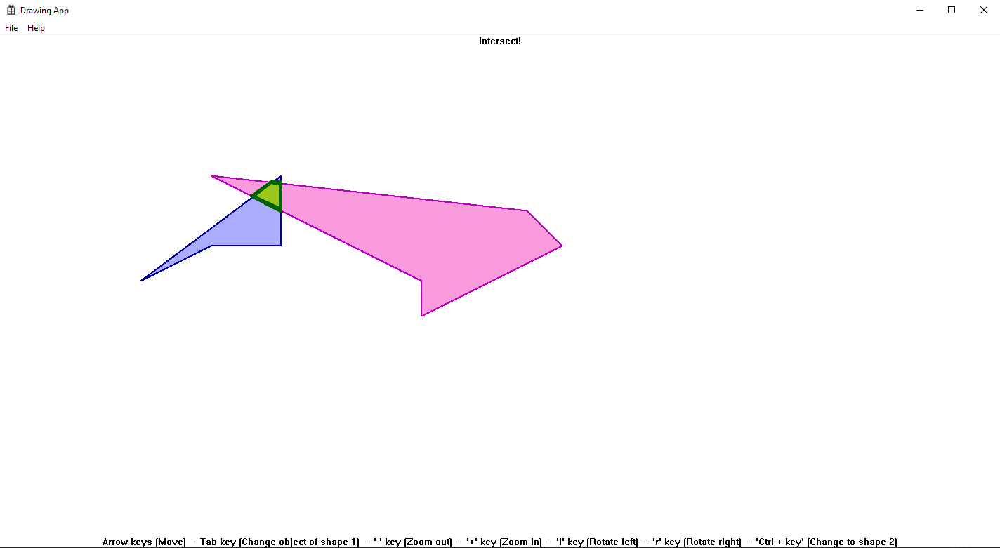</center>

Các nút để tương tác với <span style="color:#acacff">hình (màu xanh tím)</span>:
- Dùng chuột di chuyển hình bằng cách kéo thả
- Sử dụng các phím mũi tên **⭡⭣⭠⭢** để di chuyển hình
- Nút $Tab$ thay đổi *hình*
- Nút $+$ để **phóng to** và $-$ để **thu nhỏ** 
- Nút $L$ xoay trái và $R$ xoay phải $(90^\circ)$

Để có thể tương tác <span style="color:#f99bdd">hình (màu hồng)</span>: Ấn giữ $Ctrl$ + các nút như <span style="color:#acacff">hình màu xanh tím</span>

Một số kết quả khác:
<center>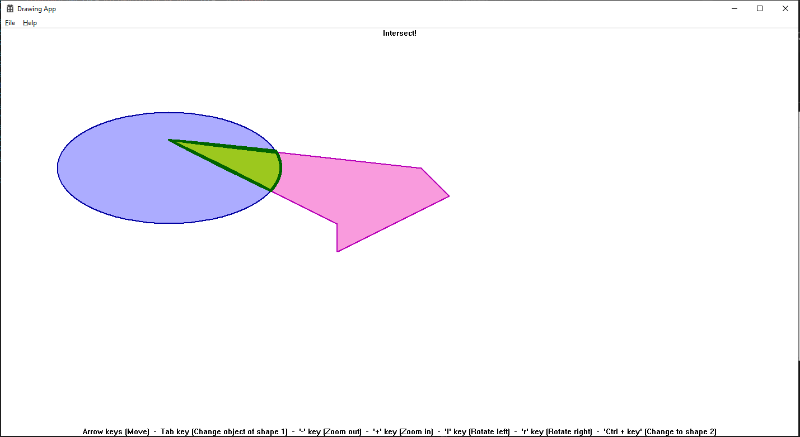</center>
<center>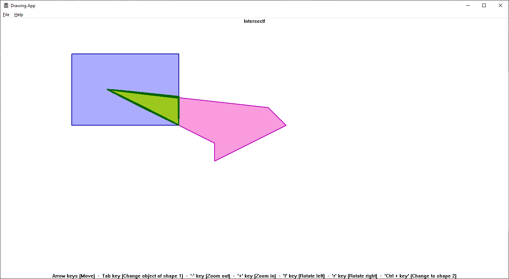</center>
<center>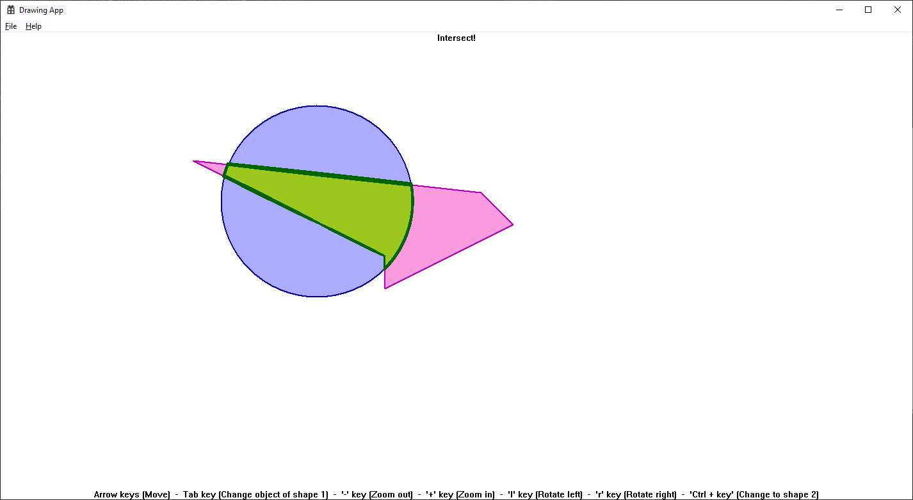</center>
<center>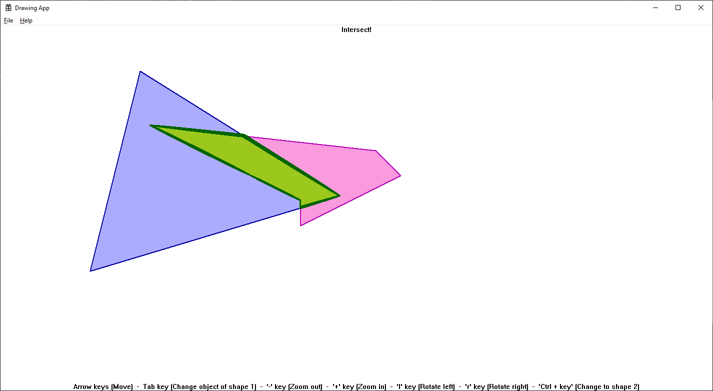</center>
<center>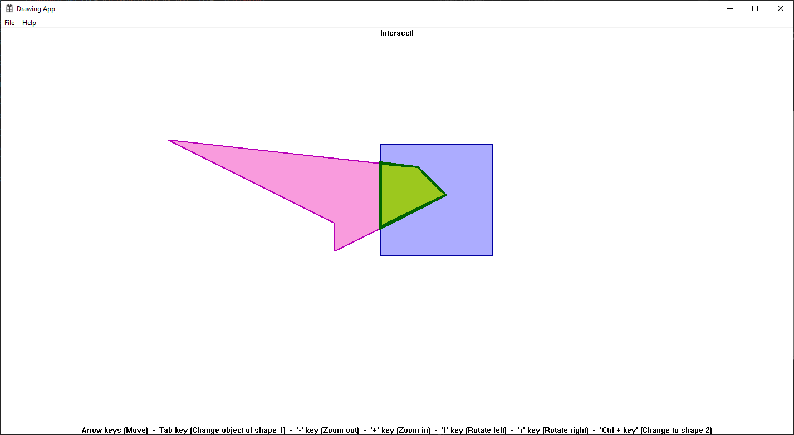</center>
<center>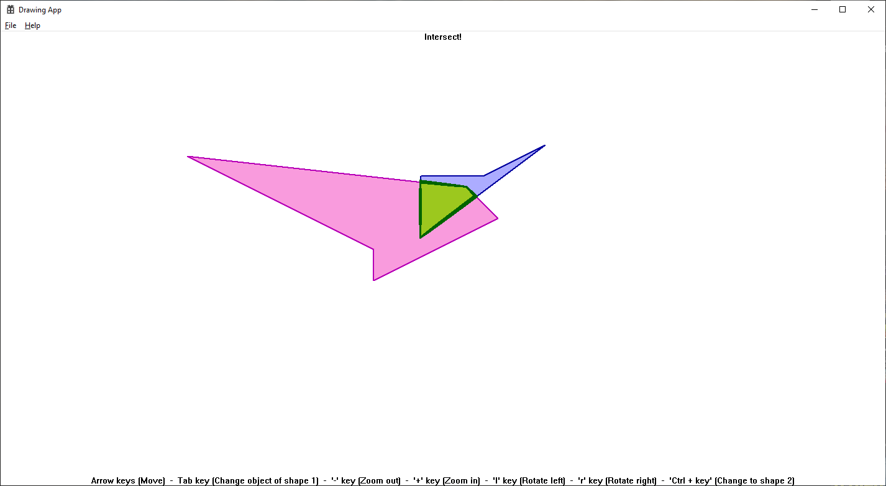</center>
<center>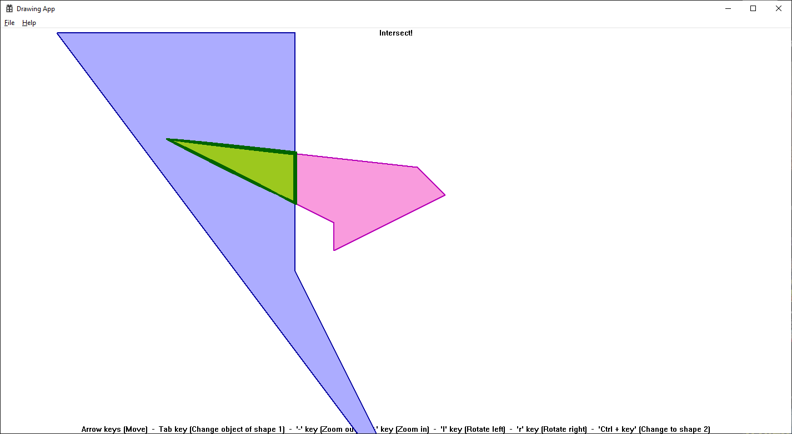</center>
<center>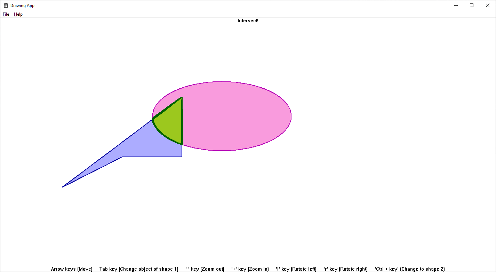</center>
<center>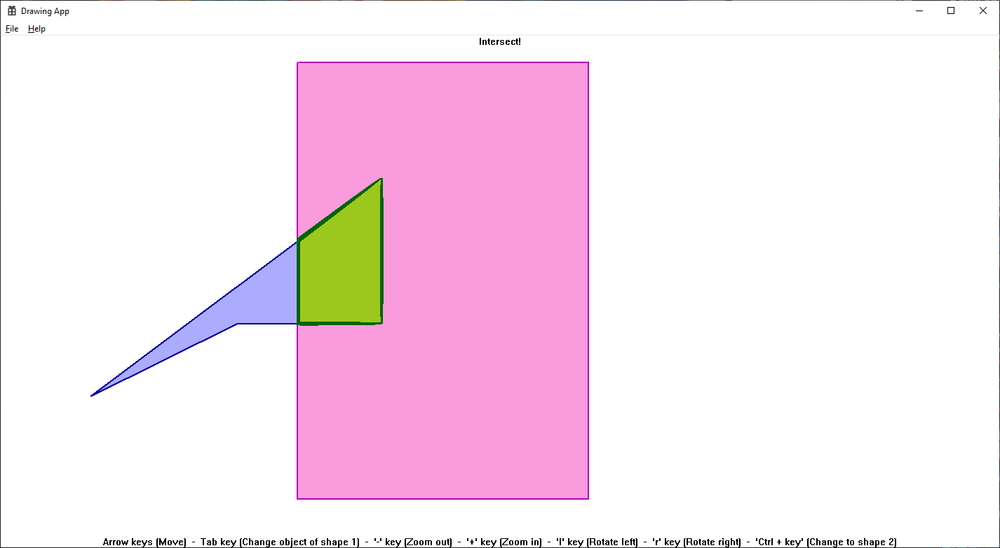</center>
